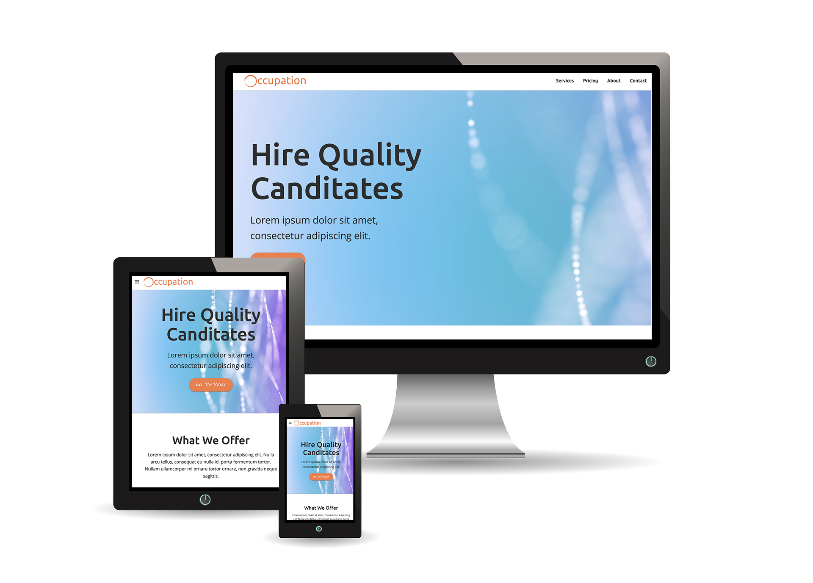

# AI Project - Occupation - Demonstration Website

## General Info

[Occupation](https://jennifer0101.github.io/AI-Project/) is a demonstration website to showcase a business style with bright colors and futuristic elements designed with the Materialize framework. The website features one page that scrolls to different sections using the navigation bar links at the top. It has a focus on user experience and user interface and is fully mobile responsive.  

## Technologies

* JQuery
* CSS3
* HTML5
* Materialize 1.0.0

## Project Status

This project is complete.

## Contact
Created by [@jennifer0101](https://www.fayecreative.com) - feel free to contact me!